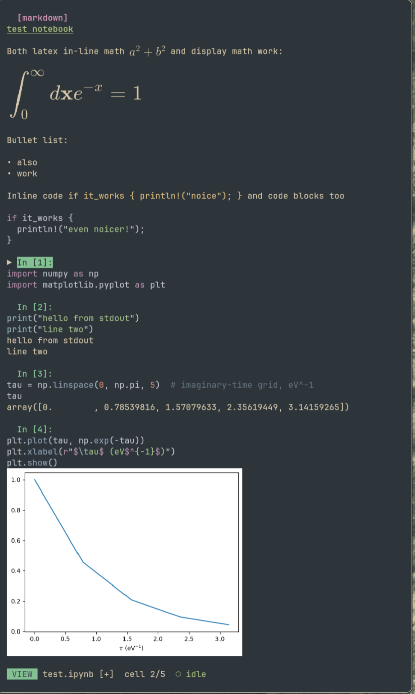

<div align="center">

# jOtter 🦦

**A fast Jupyter notebook TUI. The Jupyter otter.**


</div>

Open, edit, and run real `.ipynb` notebooks in your terminal with vim keys, inline plots, and rendered LaTeX — with keystroke latency so low that holding a key is a non-event.

<div align="center">

</div>

## Features

- **Real nbformat**: opens and saves `.ipynb` losslessly — cell ids, metadata, and fields written by other tools survive round-trips untouched.
- **Fast**: single-digit-microsecond redraws (Rust + [ratatui](https://ratatui.rs)); cell bodies are cached and rebuilt per cell, never per keystroke.
- **Vi editing**: modal editor inside cells (`hjkl`, `w b e`, `dd yy p`, `u`/`Ctrl+r`, ...), with modal cursor shapes, and `E` to open the cell in `$EDITOR` for anything heavier. Or set `editor = "nvim"` to let an embedded nvim drive cell editing — the full modal engine (operators, visual mode, registers, macros) with jotter still rendering.
- **Kernel execution**: launches any Jupyter kernelspec over ZMQ, streams outputs live, interrupt with `Ctrl+C`, restart with `R`. Kernel cwd is the notebook's directory, like jupyterlab.
- **Kernel resolution ladder**: activated env (`$VIRTUAL_ENV`, `$CONDA_PREFIX`) → `.venv`/`venv` beside the notebook → the notebook's kernelspec → global kernels → `python3` fallback. Works with uv, poetry, conda, pixi — anything that installs `ipykernel`.
- **Inline graphics**: matplotlib PNGs render in-terminal via the kitty graphics protocol (sixel/iTerm2/halfblocks fallback through [ratatui-image](https://github.com/benjajaja/ratatui-image)).
- **LaTeX**: `$$display$$` and `$inline$` math render as real equations (via [ratex](https://crates.io/crates/ratex-svg)); raw cells with `metadata.format: text/latex` render entirely as math. No TeX installation needed.
- **Markdown cells** render rich (headings, bullets, fenced code with syntax highlighting, math) when not being edited.
- **Mouse**: click to select or place the cursor, double-click to insert, wheel to scroll. `Shift+drag` for native text selection, `yy` copies a cell to the system clipboard (OSC 52).
- **Jupyter stream semantics**: consecutive stream chunks coalesce, `\r` progress bars (tqdm) overwrite in place, `clear_output` works, and per-cell output is capped at the last 10k lines.
- **Long outputs** display as a scrollable viewport pinned to the live tail — wheel over it or `[`/`]` to scroll, `o` to collapse.
- **Data safety**: atomic fsync'd saves, autosave sidecar for crash recovery, save/discard/cancel prompt on quit, and a warning instead of a silent overwrite when the file changed on disk.
- **input() support**, run-all/above/below with a queued/running gutter, `/` search across cells, cell-op undo, per-cell execution timing, a log viewer (`L`), and a per-cell debug report (`D`, copied to the clipboard) for bug reports.

## Install

```sh
cargo install --path .   # or: make install
nix run github:samox/jotter -- notebook.ipynb   # or build via the bundled flake
```

Rust 1.85+ (edition 2024). No native dependencies — the ZMQ stack is pure Rust.

## Usage

```sh
jotter notebook.ipynb              # kernel from notebook metadata
jotter --kernel phy notebook.ipynb # explicit kernelspec
jotter --no-images notebook.ipynb  # text-only outputs
jotter --log jotter.log nb.ipynb   # debug log (jotter + kernel wire)
```

Press `?` inside for the full key reference.

|  |  |
| --- | --- |
| `j/k` `g/G` `5G` | select / first / last / numbered cell |
| `Enter` `i` `A` | edit cell (vi bindings inside, `Esc` exits) |
| `Shift+Enter` / `Ctrl+Enter` / `r` | run cell (+advance / in place / +advance) |
| `Ctrl+r` `<` `>` | run all / all above / cell and below |
| `a`/`b` `dd`/`p` `J`/`K` `u` | insert, delete/paste, move cells, undo |
| `/` `n` `N` | search cell sources / next / previous |
| `o` `[` `]` | collapse / scroll long outputs (or wheel over them) |
| `z` / `Z` | zoom image fullscreen / toggle native-size images |
| `m` | cycle cell type: code → markdown → latex |
| `yy` | copy cell source to clipboard |
| `E` | edit cell in `$EDITOR` |
| `w` (`W` force) / `q` | save / quit |
| `Ctrl+C` / `R` | interrupt / restart kernel |
| `L` / `D` | view logs / debug info for the cell (copied to clipboard) |

## Config

Optional, at `~/.config/jotter/config.toml` — every key has a default:

```toml
max_image_rows = 18     # images taller than this are downscaled once (Lanczos)
max_output_rows = 15    # output rows shown before the viewport scrolls
autosave_secs = 30      # autosave sidecar interval
theme = "base16-ocean.dark"  # try base16-ocean.light on light terminals
editor = "builtin"      # "nvim": embedded nvim drives cell editing (experimental)
```

With `editor = "nvim"`, a hidden `nvim --embed` owns the cell buffer while jotter keeps rendering: full modal editing (`dw`, `ciw`, visual mode, counts, registers, macros, `.`), per-cell undo history, `:`/`/` echoed in the status bar, `:w` commits the cell, and `:q`/`:wq`/`ZZ` leave it (`:q!`/`ZQ` discard the edit). Falls back to the builtin editor if nvim is missing or dies.

## Known limits

- Images wider than the terminal crop at the right edge instead of scaling (keeps the one-time high-quality downscale; no render-time rescaling, no aliasing).
- Terminal resize resets output-viewport positions; a font-size change (terminal zoom) re-transmits all images.
- Non-goals: ipywidgets (placeholder only), multiple tabs, remote/existing kernels, Windows.

## Terminal support

Best in [kitty](https://sw.kovidgoyal.net/kitty/) (graphics + keyboard protocol → `Shift+Enter`, distinct modifier keys). Any terminal works: graphics fall back to sixel/iTerm2/unicode halfblocks, and `r` runs cells where `Shift+Enter` can't be distinguished.
